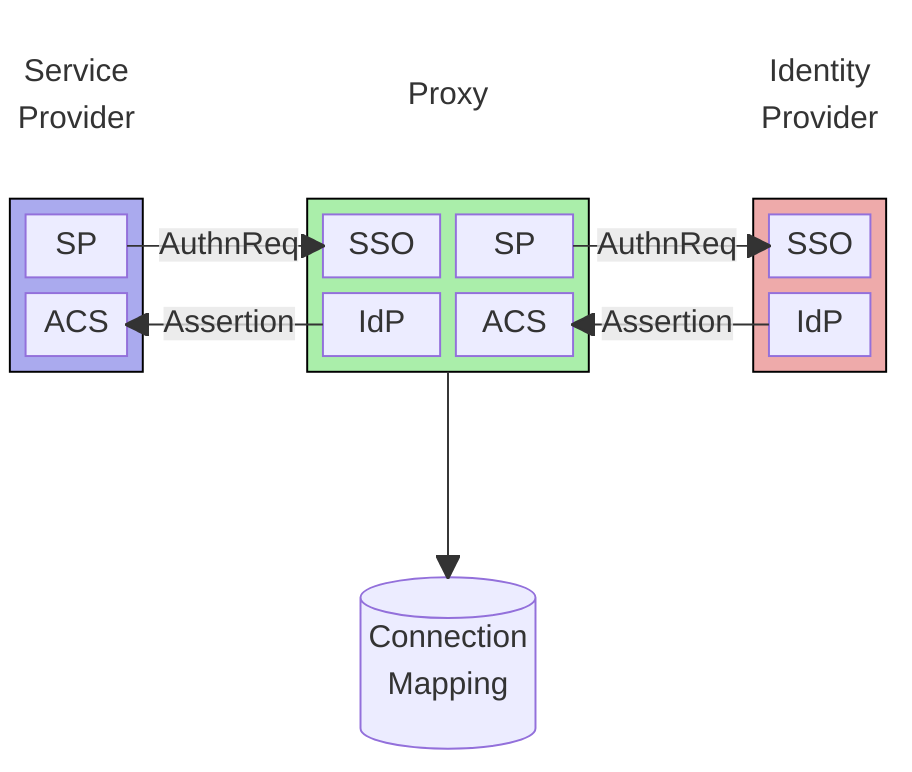
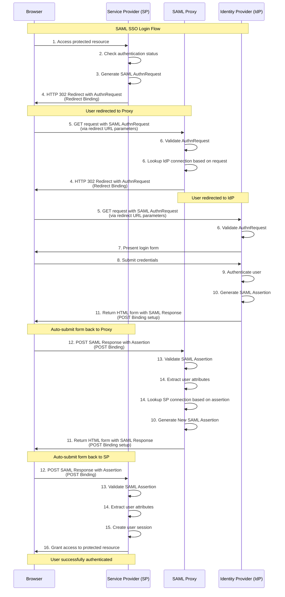

# SAML Proxy

An an example implementation of a SAML IdP Proxy

__WARNING__: This project is provided as an example only. It comes with no waranty whatsoever. Use at entirely your own risk.

## Table of Contents

- [Introduction](#introduction)
- [Why would I need one?](#why-would-i-need-one)
- [How to run the demo](#how-to-run-the-demo)
- [How it works](#how-it-works)
- [Useful links](#useful-links)
- [Development](#development)

## Introduction

A SAML IdP Proxy is a stand-alone service that sits between an SP (Service Provider - usually your application,
or a 3rd party IaaS), and an IdP (Identity Provider - the authentication system. This can
be an in-house implementation or a 3rd party provider such as AWS Cognito, Okta, or Auth0). It can
route, modify, log, and enhance SAML interactions.

The SAML Proxy acts as an IdP to your SP, and an SP to your IdP, and provides a mapping between them. See the diagram below:



This project provides a fully functional implementation of a SAML Proxy intented as an example or starting point for your own implementation.

It also includes a Test SP and a Test IdP for demonstration purposes, but these could also be the starting point for your own implementation.

See below for instructions on how to run and inspect the demo.

## Why would I need one?

There are many reasons why you might need, or want, to use a SAML IdP Proxy. Fundamentally it allows you to decouple your SSO enabled
applications from your identity providers. Some suggestions, but by no means an exhaustive list:

* __Avoid IaaS vendor lock-in__: Every B2B SaaS product needs to offer "enterprise SSO" - SAML authentication - to its customers.
It's an enormous time saver for SaaS venders to integrate with an Identity as a Service (IaaS) provider, such as OAuth, AWS Cognito, or Clerk
rather than implement identity management, authentication and authorization in house.
But with each of your customers individually configuring their own IdP to talk to your IaaS provider, it makes for a very
deep lock-in. Without a proxy you will have to persuade each customer in turn to reconfigure their IdP before you can escape from your
IaaS. With a proxy, you can migrate all your customers instantly to a different IaaS, or your own SP implementation.
* __Auditing monitoring and logging__: IaaS providers can often be opaque black boxes when it comes to auditing, monitoring, or logging,
which can make fulfilling regulatory requirements or diagnosing authentication issues difficult. A SAML Proxy can provide a tap for
comprehensive logging of all SAML operations.
* __Identity Provider Consolidation__: Provide a single IdP endpoint to applications while routing to different IdPs based on arbitrary
criteria (email domain, user ID, name of cat, whatever).
* __Service Provider Consolidation__: Provide a single SP endpoint for multiple applications and route appropriately. This could be
useful in a company merger scenario for example.
* __Attribute Transformation__: Modify SAML Assertion attributes to match the expectations of your applications. For example, your
SP might expect an `employeeId`, but your IdP can only provide a `userId`.
* __Enhanced Security__: Add additional authentication factors, session management, or security policies. Perhaps you want to enforce
fully encrypted assertions, but your service provider can't accept them.
* __Anonymize__: You might want to hide the details of your SPs from IdP(s) or vice-versa.

## How to run the demo

This project is intended as a runnable demo to demonstrate how one can configure and use a SAML Proxy. It's intended
to be easy to setup and run.

1. Install [Bun](https://bun.sh/) by following the instructions on the [Bun website](https://bun.sh/docs/installation)
1. Clone the repository.
1. Execute `bun install` in the root directory.
1. Execute `bun run setup` in the root directory. This creates the `.env` file and X509 certificates.
1. Execute `bun run dev` in the root directory.
1. This will launch a cluster of SP, Proxy, and IdP. Use the displayed localhost URL to navigate to the SP.
1. Login as one of the displayed users. Watch as you are redirected to the IdP to authenticate.
1. To try the IdP-initiated flow, navigate directly to the IdP URL, authenticate then click the button to initiate the SAML flow to the SP.

## Demo Video

Here's a walkthrough of the SAML Proxy in action:

<video width="100%" controls>
  <source src="saml_proxy_demo.mov" type="video/quicktime">
  <source src="saml_proxy_demo.mp4" type="video/mp4">
  Your browser does not support the video tag.
</video>

_Note: You may need to convert the .mov file to .mp4 for broader browser compatibility using a tool like ffmpeg: `ffmpeg -i demo.mov demo.mp4`_

To view the SAML interactions install a SAML tracing browser plug-in. I use [SAML Chrome Panel](https://chromewebstore.google.com/detail/saml-chrome-panel/paijfdbeoenhembfhkhllainmocckace?hl=en)

## How it works

This interaction diagram shows the SP-initiated flow:



## Useful links
* [SAML Technical Spec](https://docs.oasis-open.org/security/saml/Post2.0/sstc-saml-tech-overview-2.0-cd-02.html)
* [SAML XML Entity Spec](https://docs.oasis-open.org/security/saml/v2.0/saml-core-2.0-os.pdf)
* [Samlify Docs](https://samlify.js.org/#/?id=samlify)


## Development
SamlProxy uses [Bun](https://bun.sh/). Install it by following the instructions on the [Bun website](https://bun.sh/docs/installation)

Create the `.env` file and X509 certificates with:
```zsh
bun run setup
```
(_Optional_ Customize your setup by modifying `.env.template` before running `bun run setup`)

This is a monorepo containing 3 packages:
1. `proxy`: This is the core proxy package.
1. `testsp`: This is a test SAML service provider (SP). This mimics the application that needs to authenticate.
1. `testidp`: This is test SAML identity provider (IdP). This mimics an identity provider, such as Okta or Auth0.

Start with:
```zsh
bun run dev
```
The script `scripts/cluster.ts` will start all three processes at the following URLs:

| process | URL |
|---|---|
| proxy | <http://localhost:7272> |
| sp    | <http://localhost:7282> |
| idp   | <http://localhost:7292> |

Run unit tests with:
```zsh
bun test
```
