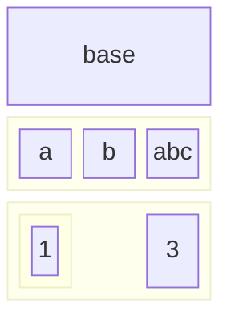
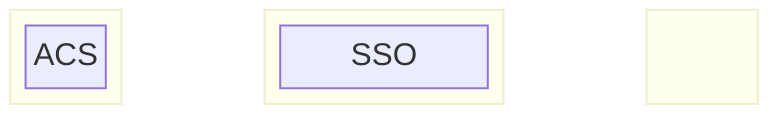

# samlproxy
An an example implementation of a SAML IdP Proxy

# How it works






## Useful links
* [SAML Technical Spec](https://docs.oasis-open.org/security/saml/Post2.0/sstc-saml-tech-overview-2.0-cd-02.html)
* [SAML XML Entity Spec](https://docs.oasis-open.org/security/saml/v2.0/saml-core-2.0-os.pdf)
* [Samlify Docs](https://samlify.js.org/#/?id=samlify)


## Development
SamlProxy uses bun. Install bun by following the instructions on the [bun website](https://bun.sh/docs/installation)

Environment variables are held in `.envrc`. You should copy `.envrc.template` and fill in the required env vars. This project uses [direnv](https://direnv.net/) to populate env vars for local development:
```zsh
brew install direnv
```

This is a monorepo containing 3 packages:
1. `proxy`: This is the core proxy package.
1. `testsp`: This is a test SAML service provider (SP). This mimics the application that needs to authenticate.
1. `testidp`: This is test SAML identity provider (IdP). This mimics an identity provider, such as Okta or Auth0.

Start with:
```zsh
bun run dev
```
The script `scripts/cluster.ts` will start all three processes at the following URLs:

| process | URL |
|---|---|
| proxy | <http://localhost:7272> |
| sp    | <http://localhost:7282> |
| idp   | <http://localhost:7292> |
